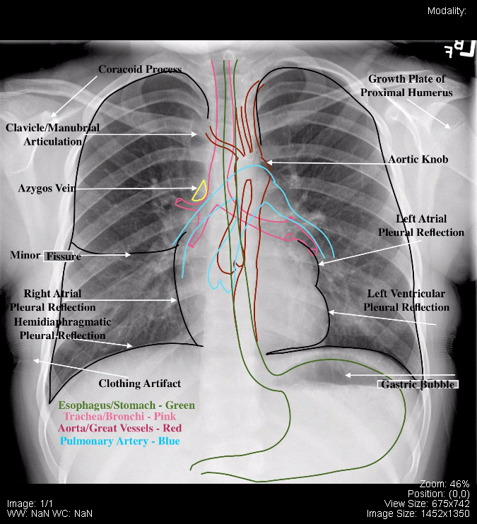
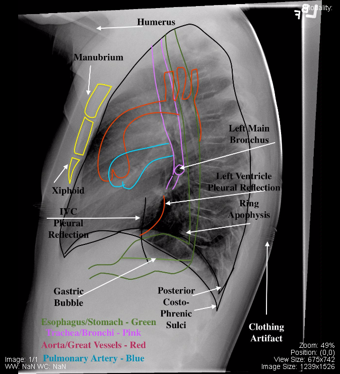

# CXR
- [[lung-anatomy]] 
- [[Chest]]
## PA
- 
- 

[//begin]: # "Autogenerated link references for markdown compatibility"
[lung-anatomy]: lung-anatomy.md "lung-anatomy"
[Chest]: tags/Chest.md "Chest"
[//end]: # "Autogenerated link references"