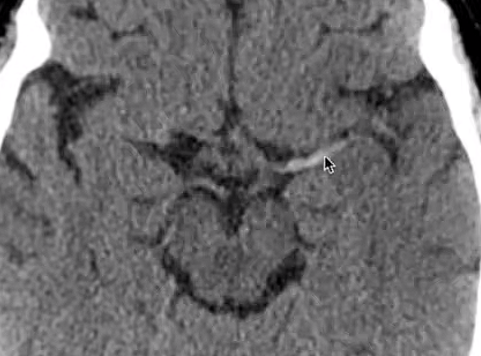

#   Brain CT: search patterns and check areas with Andrew Dixon
-[[Neur]]
> (https://www.youtube.com/watch?v=u3NPBiYDqwA)
>> Speaker: Andew Dixon
- interpenuncular system trace SAH
- 
## suspected stroke

- MCA stroke

- M3
- 
- Vertigo
- 
- Expressive dysphagia
- 
- 
- 
- right upper and lower limb numness
- 
- dizziness, pontine infarct
- 
- left horner 
- 

## severe headache
- Right MCA aneurysm rupture
- 
- Dural sinus thrombosis
- 
- 
- 
- sinus thrombosis venous infarct related swelling
- 
- 
- H/A vomiting, intracranial hypotension
- 
- H/A, intracranial hypertension
- 
- 
- [[colloid cyst]]
- 
- 

[//begin]: # "Autogenerated link references for markdown compatibility"
[Neur]: ../tags/Neur.md "Neur"
[colloid cyst]: <../colloid cyst.md> "Colloid cyst"
[//end]: # "Autogenerated link references"