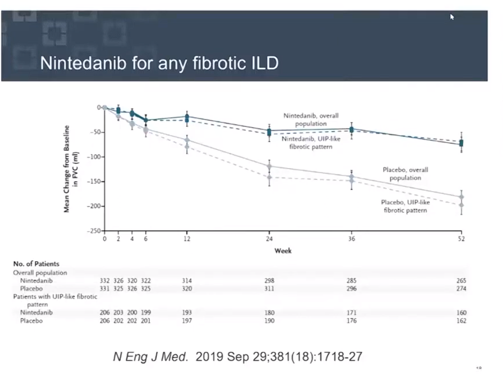

# Post COVID Interstitial Lung Disease
>Speaker: Jeffery Chapman
>>Cleveland clinic Abu Dhabi
- Sars-Cov-2
  - spike protein S1
  - binds to ACE2
  - S1 and S2 are cleaved by furin
  - S2' by TMPRSS2
  - early high viral load
  - delayed cytokine storm
- hepatization of lung
- 
- DAD COVID
- 
- 
- 
- 
- Inhaled corticosteroids
  - DOES ICS INCREASE
    - infection, symptomatic disease, progression 
    - No, (they decrease ACE2?)
  - Faster recovery, no benefit in overall outcome, not recommended, Lancet
- Early prednisolone 40mg, GOOD!
- 
- 
- 
- 

- [[Chest]] [[ILD]] [[COVID]]

[//begin]: # "Autogenerated link references for markdown compatibility"
[Chest]: ../tags/Chest.md "Chest"
[ILD]: ../tags/ILD.md "ILD"
[COVID]: ../tags/COVID.md "COVID"
[//end]: # "Autogenerated link references"