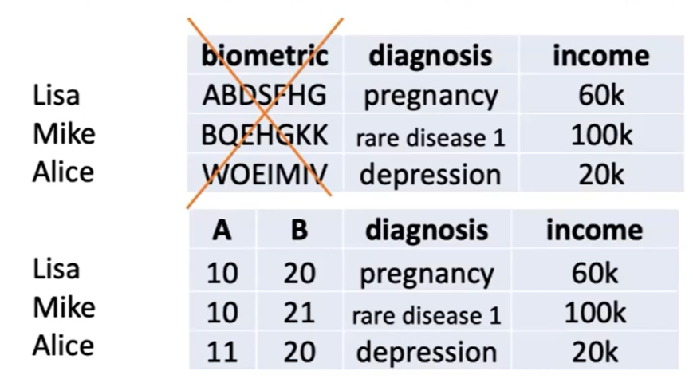

# Deep-Reconstruction-Workshop-2023

- [day 1 ​Biomedical Informatics Strategies to Enhance Individualized Predictive Models](#day-1)
- [day 2 ​](#day-2)

## Day 1: 
> Keynote Lecture: ​Biomedical Informatics Strategies to Enhance Individualized Predictive Models
>> Speaker: Lucila Chno-Machado,  
>> Yale University

- a general image of bioinformatics
- 
- 1960 MGH
- 
- 2000 Brigham
- 
- 2020  UCSD
- 
- 
>statistic and machine learning models

- MELD, AKI
- adaption to local population is important
  

>privacy
- right to share, right not to share, moving data
- combinations of values can identify individuals
- 
- k anonymity i diversity
- Genomes should be treated as HIPAA identifiers
- Golden state killer identified because cousin submitted DNA data
- 
- Distributed analysis
- 
- All of us
- 
- 
- 
- 
- 
- 
- 
- 

## Day 2: