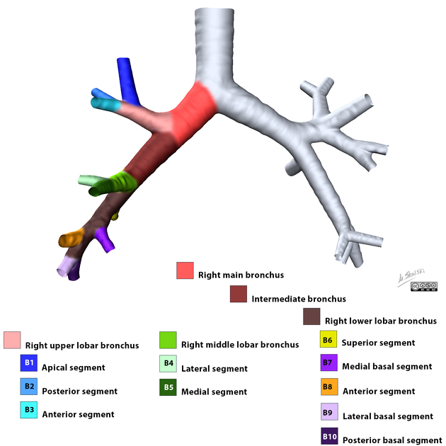
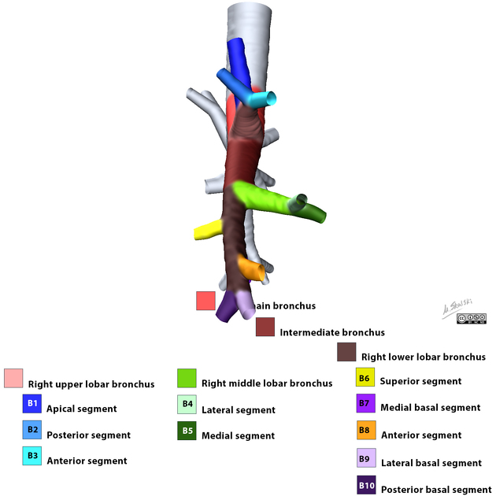
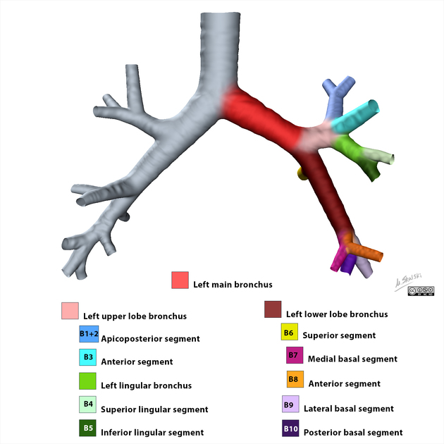
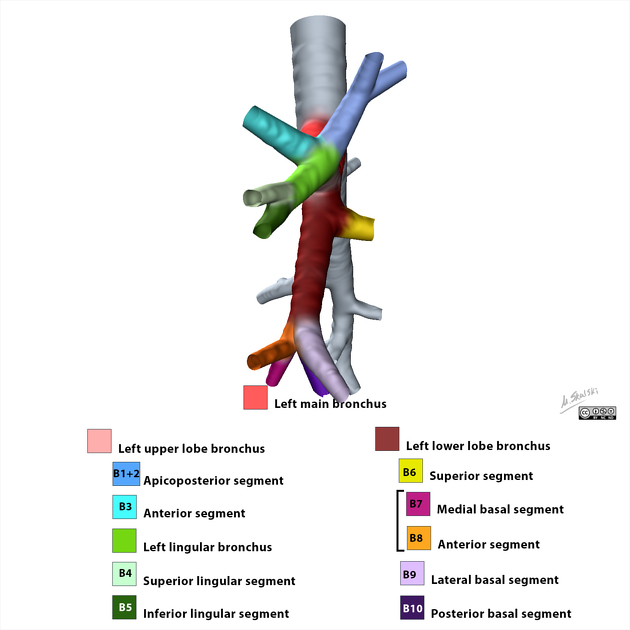

# lung-anatomy
- [[Chest]]
- 
## Bronchus
- right PA
- 

- right lateral

- left PA
- 
- left lateral
- 

[//begin]: # "Autogenerated link references for markdown compatibility"
[Chest]: tags/Chest.md "Chest"
[//end]: # "Autogenerated link references"